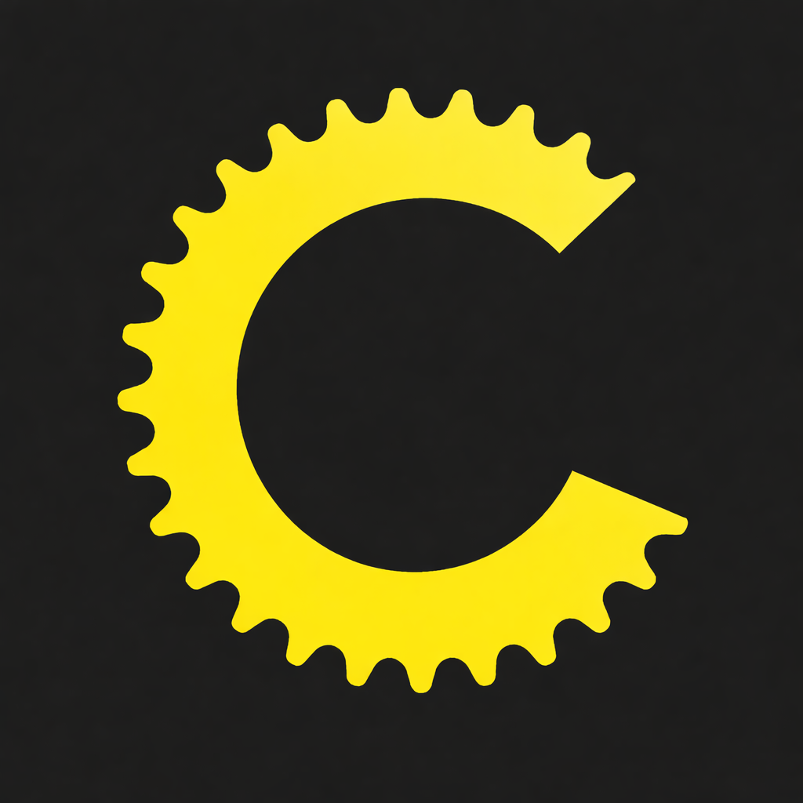

# OpenCrank

Forever free indoor cycle training

## Why?
If you don't get why you should pay $15 per month to set the wattage of you Hometrainer: this is for you. Sure: You'll loose horrible 3D graphics.

## Features

- No setup required - just launch the website in you browser (chrome preferred) - feel free to use a local HTML file
- Set the wattage 
- Read the wattage and crank RPM
- Tested on Kickr Core 2

## Next steps

- [ ] Set your FTP / weight to display zone
- [ ] Display historic wattage over past minutes
- [ ] Predefine trainings based on current science (use JSON to make it easily extendable), e.g. "Rønnestad-Intervals"
- [ ] When you're in training mode, make it easy to make it a bit harder / easier with dedicated buttons
- [ ] Create a cool logo

## Guiding principles 

- Always vibe code
- Always compile into a single HTML file
- No backend, everything is stored in your browser

## For devs

`npm run build` to build new version.
